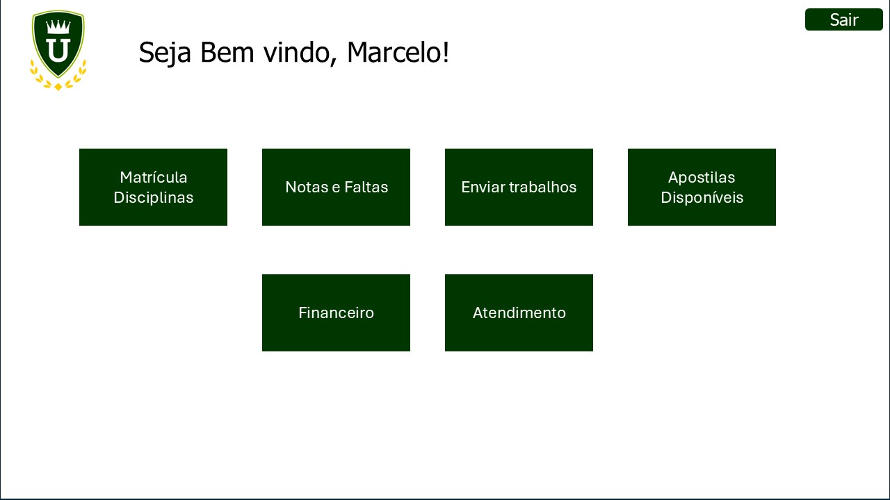
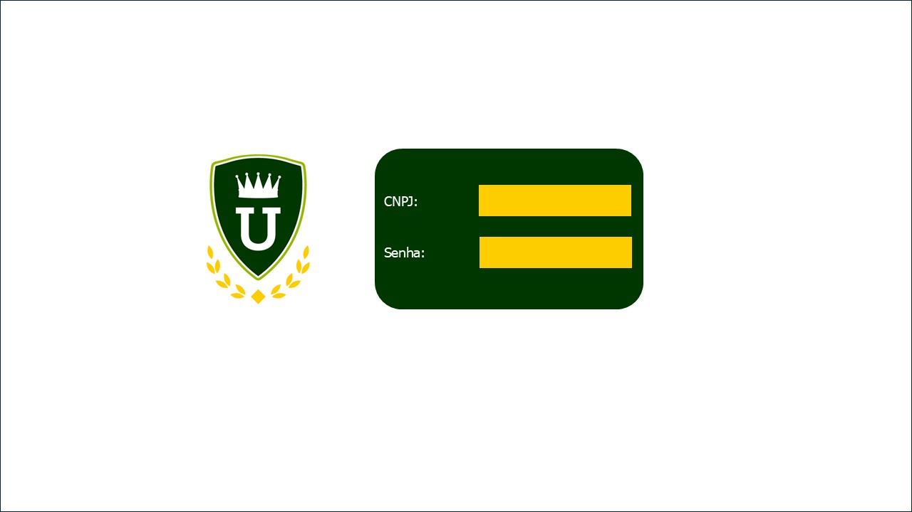
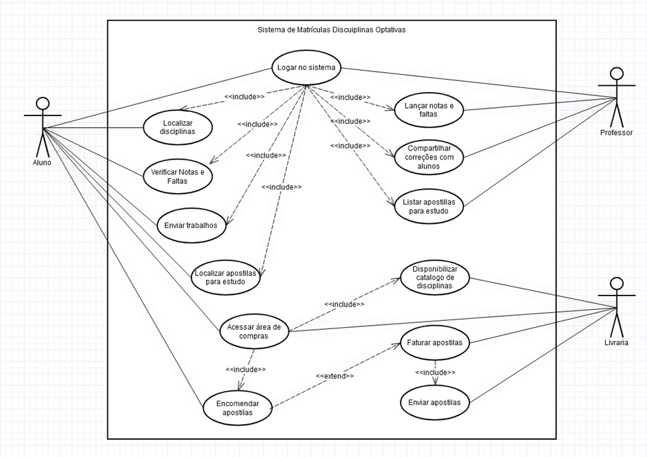

# Projeto Integrador - Desenvolvimento de sistemas Orientado a objetos

Repositório criado para o trabalho integrador do terceiro semestre do curso de Desenvolvimento de Sistemas Orientado a Objetos - SENAC 2024

## Requisitos

**Alunos**

- Localizar disciplinas;
- Verificar notas e faltas;
- Enviar trabalhos;
- Localizar apostilas para estudo;
- Acessar área de compras;
- Encomendar apostilas.

**Professores**

- Lançar notas e faltas;
- Compartilhar correções com alunos;
- Listar apostilas para estudo.

**Fornecedores**

- Disponibilizar catálogo das disciplinas;
- Faturar apostilas;
- Enviar apostilas;
- Acessar área de compras;
- Encomendar apostilas.

## Protótipo

***Jornada Aluno:*** Cadastro em disciplinas optativas

***Jonada Professor:*** Lançamento de notas e faltas

***Jornada Fornecedor:*** Listagem de apostilas em estoque disponíveis para comercialização

## Diagrama de Casos de Uso

## Diagrama de Classes

